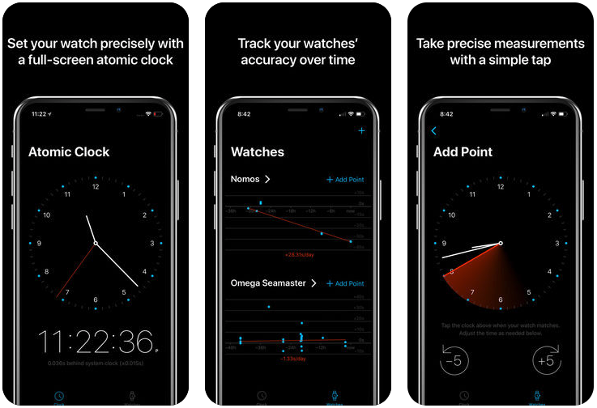
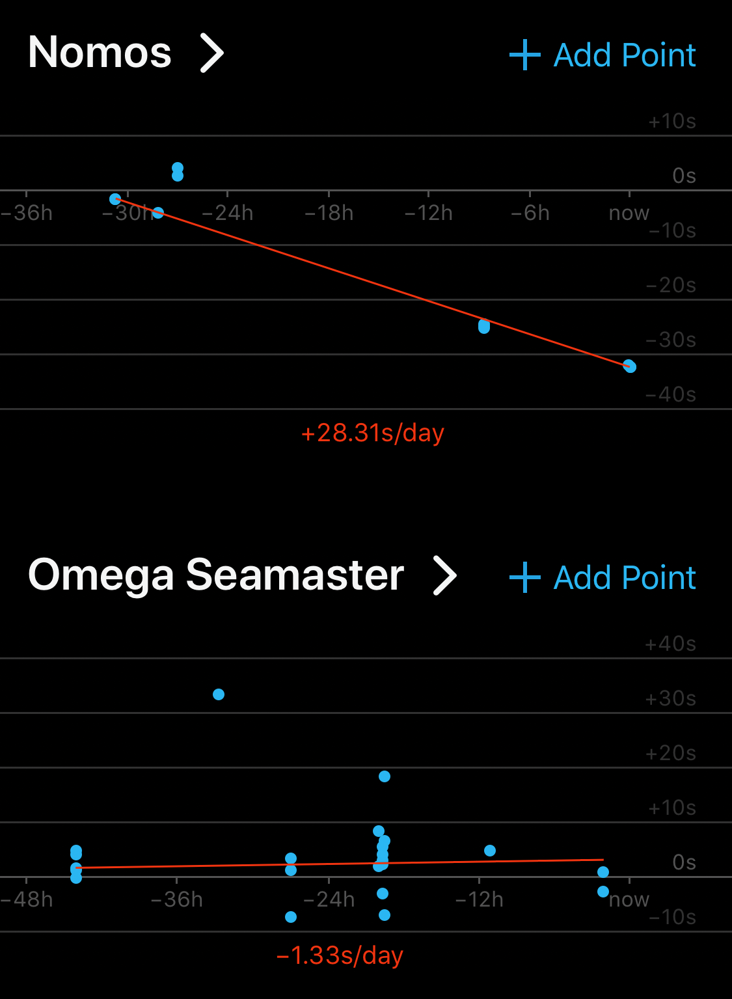
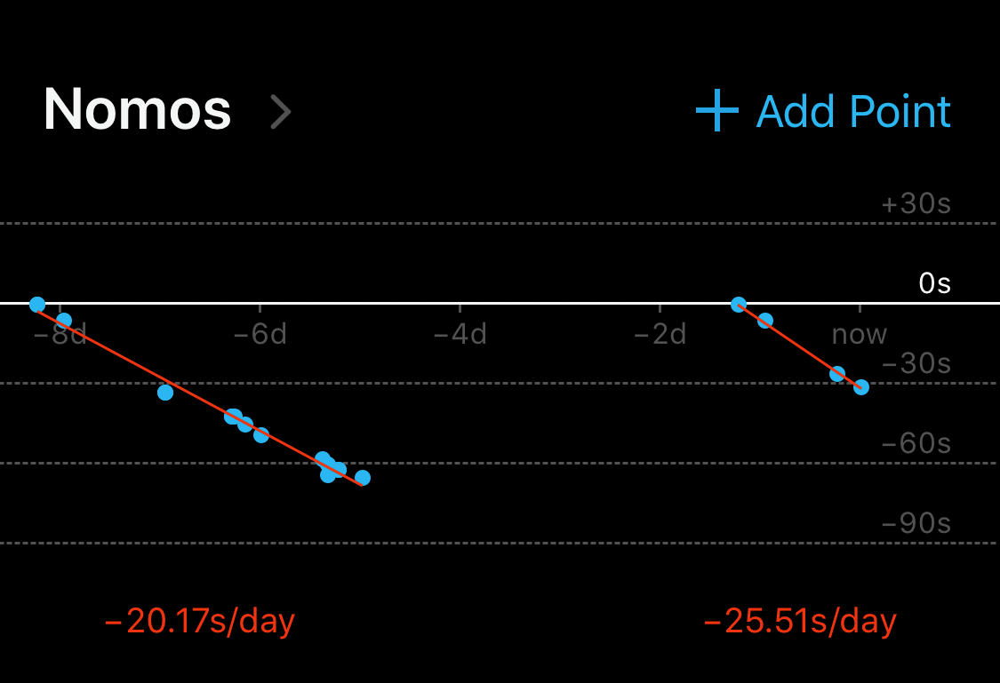
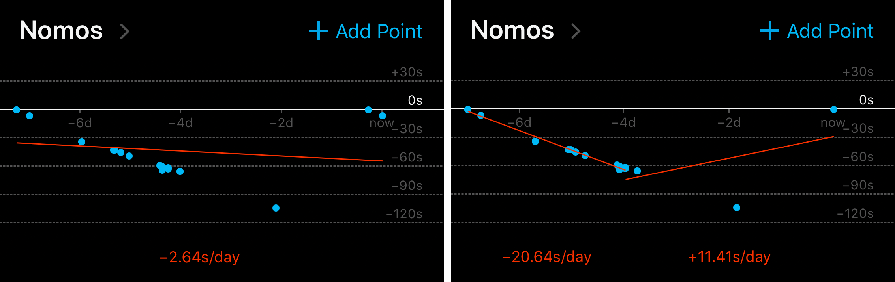
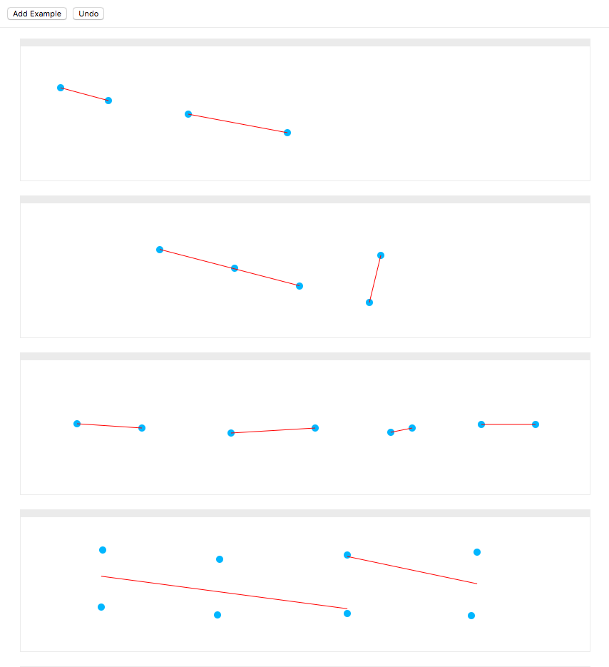
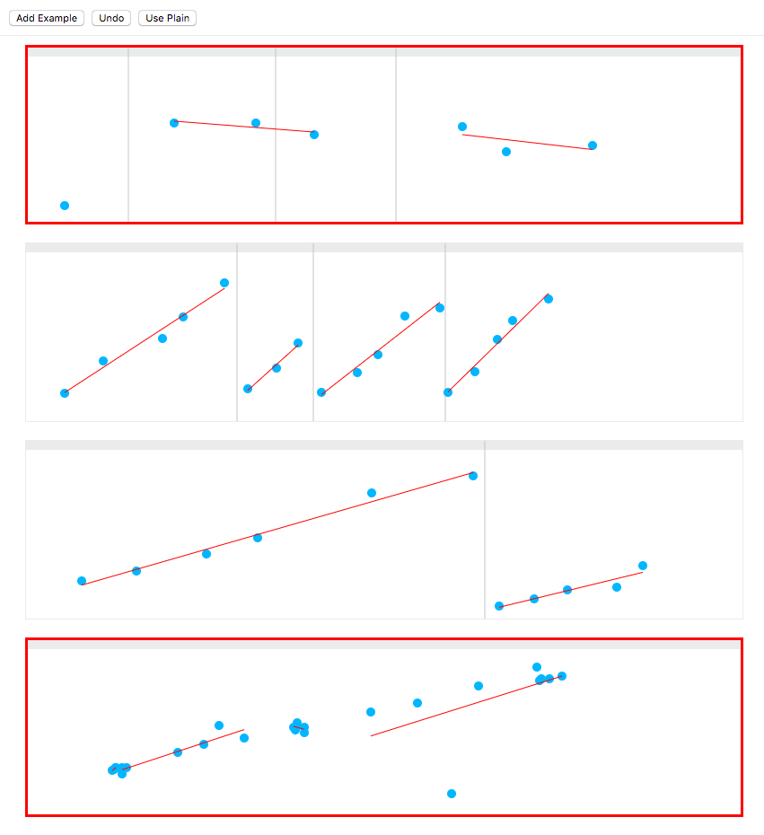
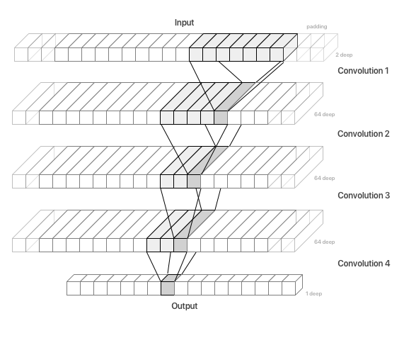

Ever felt like ML tutorials are a little too pie-in-the-sky, and short on practical details that you can actually use? If so, you might find this story interesting.

This is the story of how I trained a relatively simple neural network, but one that solves a well-defined and novel problem in a real iOS app. I’m laying it all out, from identifying problem to curating the dataset all the way to shipping the trained neural network and hooking it up to the UI.

I hope this inspires you to start sprinkling neural networks into your apps as well, even if you’re working on something slightly less ambitious than digital assistants or self-driving cars.

### The Challenge

I recently built [a little iOS app](https://itunes.apple.com/us/app/movement-watch-tracker/id1329445157) for mechanical watch fanciers to track the accuracy of their watches over time.


<figcaption><a href="https://itunes.apple.com/us/app/movement-watch-tracker/id1329445157">Movement - Watch Tracker</a> as presented in the App Store.</figcaption>

In the app, watch owners periodically add measurements by tapping the screen when their watch shows a certain time. Over time these measurements tell the story of how each of your watches is performing.

> ##### Mechanical Watch Rabbit Hole
> If you don’t own a mechanical watch, you may be questioning the whole point of this app. Hell, maybe even the whole point of owning an expensive, inaccurate watch in the first place. If you’re one of _those_, just bear with me. All you need to know is that mechanical watches are inaccurate: they gain or lose a few seconds per day if they’re good, a few minutes if they’re bad. They need to be periodically reset – they stop running if you don’t wear them or wind them. And they need to be periodically serviced. If they’re anywhere near a magnet, they become “magnetized” and become much less accurate until they’re demagnetized using a special machine.
>
> Watch lovers can get really attached to their timepieces, and can become obsessed about maintaining and measuring their accuracy. Knowing your watch is accurate can increase your pride in your watch tenfold. And knowing your watch is inaccurate can let you know when it’s time to take it in for service (besides getting you on time to meetings).
>
> Why bother with all this? I guess that’s a very personal question. What ultimately sold me on the appeal of mechanical watches was realizing that they are a piece of jewelry that’s also a perfect synergy of design and engineering in physical form. I’ve been trying to marry the two my entire life (hence the name of my consulting company, [Rational Creation](https://rationalcreation.com/)), so wearing both on my wrist just feels right.

One of the main features of the app is a chart of the measurements, with trendlines estimating how your watch is performing.


<figcaption>Watch charts and trendlines in the app.</figcaption>

Computing a trendline across given points is easy. You can use a simple <a title="Wikipedia" href="https://en.wikipedia.org/wiki/Linear_regression">linear regression</a>, or you can even get fancy and use a <a title="Wikipedia" href="https://en.wikipedia.org/wiki/Robust_regression">robust regression</a> (such as <a title="Wikipedia" href="https://en.wikipedia.org/wiki/Theil–Sen_estimator">Theil-Sen</a>) to minimize the impact of inaccurate or stray measurements.

However, what often happens with a mechanical watch – especially one that’s not running very well – is that you reset it to the current time every few days. Or you skip wearing it for a couple days, and its “charge” depletes, so you have to reset it. These events create a “break” in the trendline. For example:


<figcaption>Two very clearly separate runs: each gets a trendline.</figcaption>

It looks like I didn’t wear that watch for a couple of days, and when I picked it up again, I started over from zero.

I wanted to show separate trendlines for each of these runs, but I didn’t want to ask my users to do extra work each time they reset their watch. I imagined I could pretty easily figure out where to split automatically.

My plan was to Google my way out the problem, like I did earlier when looking for a robust linear regression formula. I pretty quickly found what felt like the right keywords (<a title="Wikipedia" href="https://en.wikipedia.org/wiki/Segmented_regression">segmented regression</a>, and [piecewise linear regression](https://onlinecourses.science.psu.edu/stat501/node/310)). And for a second I thought I’d hit the jackpot. I found [one article](https://www.datadoghq.com/blog/engineering/piecewise-regression/) that seems to solve this exact problem using basic math.

The approach is essentially brute-force, trying to split the trendline at every possible point and then deciding which splits to pick based on how much they affect the mean squared error. I implemented this, and this happened:


<figcaption>Two common failure scenarios.</figcaption>

This approach is very sensitive to the parameters you pick (like how much increase in error is acceptable), so I built a UI to help me tweak the parameters:


<figcaption>The UI I used to generate and visualize examples, with hot reload for paramater tuning.</figcaption>

Still, I got stuck. No matter how I tweaked the parameters, the algorithm was either splitting too frequently, or not frequently enough. This approach wasn’t going to cut it.

I’ve experimented for years with neural networks, but never yet had had the chance to use one in production. This was the perfect opportunity.

### The Tools

Since the goal was running the neural network production, my main concern was figuring out how I would deploy it. Many online tutorials just drop you off at the end of the training and leave this part out. But I’d decided this would be the time I’d see my neural network all the way through.

Since I was building an iOS app, [CoreML](https://developer.apple.com/documentation/coreml) was the obvious choice. It’s the only way I know of to run predictions on the GPU; last I checked CUDA was not available on iOS.

Another huge benefit of CoreML is that it’s built in to the OS, so I wouldn’t need to worry about compiling, linking, and shipping binaries of sprawling ML libraries with my little app.

> ##### CoreML Caveats
> Unfortunately CoreML is still very new, and its tools are quite rough. CoreML itself only supports a subset of all possible layers and operations. The [tools that Apple ships](https://developer.apple.com/documentation/coreml/converting_trained_models_to_core_ml) only support converting neural networks trained with [Keras](https://keras.io). Ironically, Keras models don’t seem to perform very well on CoreML. I did some inspecting of the converted Keras models and there’s a great deal of time spent converting data into Caffe operations and back. It seems likely that Apple uses Caffe internally, and Keras support was tacked on. Caffe does not strike me as a great compile target for a Keras/TensorFlow model.

I’d had mixed luck with converting [Keras](https://keras.io) models to CoreML (see box above), so I’d been on the hunt for other ways to generate CoreML models. Meanwhile, I’d been looking for an excuse to try out [PyTorch](http://pytorch.org/) (see box below). Somewhere along my research I stumbled upon [ONNX](https://onnx.ai/), a proposed standard exchange format for trained neural network models. PyTorch support is available from day one. Somehow it occurred to me to look for an ONNX to CoreML converter,  and sure enough, [one exists](https://github.com/onnx/onnx-coreml)!

> #####  What about Keras and TensorFlow?
> Like most people, I cut my neural teeth on TensorFlow. But my honeymoon phase had long faded. I was getting weary of the kitchen-sink approach to library management, the huge binaries, and the extremely slow startup times when training.
>
> TensorFlow APIs are a sprawling mess. Keras mitigates that problem somewhat, but it’s a leaky abstraction. Debugging issues is hard if you don’t understand how things work behind the scenes.
>
> As an ex-Facebook engineer, I’m biased towards any open-source code Facebook releases, so I was eager to give PyTorch a try, and...
>
> PyTorch is a breath of fresh air. It’s much faster to start up than TensorFlow, which makes iterating on my network much more immediate and fun. It has a smaller API, and a simpler execution model. Unlike TensorFlow, it does not require you build a computation graph in advance and have no insight or influence in how it gets executed. It feels much more like regular programming, makes things easier to debug, and also enables more dynamic architectures (which I hope to use some day).

I finally had all the pieces of the puzzle, from training a neural network all the way to deploying it on iOS. However, I knew from some of my earlier experiments that many things could still go wrong. Only one way to find out.

### Gathering the Training Data

In my experience with neural networks, assembling a large-enough quality dataset to train on is the hardest part. I imagine this is why most papers and tutorials out there start with a well-known public dataset, like <a title="Wikipedia" href="https://en.wikipedia.org/wiki/MNIST_database">MNIST</a>.

However, I find the standard image and text tasks boring. I like solving new problems, and I like neural networks because they can be applied to anything. So I craft brew my own micro-datasets. Since my datasets are small, I limit myself to problems that are slightly more manageable than your typical VanGogh-style portrait generation project.

Fortunately, the problem at hand is relatively simple (or so one would think), so a small dataset should suffice. On top of that, it’s a very visual problem, so generating data and evaluating the neural networks should be easy... given a mouse, a pair of eyes, and the right tools.

#### The Test UI

I had the perfect UI already. I’d built it to tweak the parameters of my brute-force algorithm and see the effects in real time. It didn’t take me long to convert it into a UI for generating training examples. I added the option to specify where I thought runs should split. And with a few clicks of the mouse and a `JSON.stringify` call I had enough of a dataset to jump into Python.


<figcaption>Test UI with manually-entered splits, and red boxes around incorrect predictions.</figcaption>

> ##### Parcel
> As an experienced web developer, building this UI as a web app with React was easy. However, there was one part I was dreading, even though I’ve done it dozens of times before: configuring [Webpack](https://webpack.js.org). I love trying new things, and so I took this as an opportunity to try [Parcel](https://parceljs.org). I’m so glad I did. Parcel worked out-of-the-box with zero configuration. It even worked with TypeScript. I was able to have a fully working web app faster than it would take me to type `create-react-app`.

### Preprocessing the Data

Another common hurdle when designing a neural network is finding the optimal way to encode something fuzzy, like text of varying lengths, into numbers a neural networks can understand. Thankfully, the problem at hand is numbers to begin with.

In my dataset, each example is a series of `[x, y]` coordinates, one for each of the points in the input, plus a list of coordinates for each of the splits that I’ve manually entered (this is what I will be training the network to learn).

<svg viewBox="0 0 800 200" style="border: 1px solid rgb(238, 238, 238); box-sizing: border-box; display: block; margin: 20px 0px; width: 100%"><rect x="0" y="0" width="800" height="10" fill="#eee"></rect><line stroke="#ccc" x1="235" y1="0" x2="235" y2="200"></line><line stroke="#ccc" x1="320" y1="0" x2="320" y2="200"></line><line stroke="#ccc" x1="467" y1="0" x2="467" y2="200"></line><circle fill="#01beff" r="5" cx="43" cy="167"></circle><circle fill="#01beff" r="5" cx="86" cy="131"></circle><circle fill="#01beff" r="5" cx="152" cy="106"></circle><circle fill="#01beff" r="5" cx="175" cy="82"></circle><circle fill="#01beff" r="5" cx="221" cy="44"></circle><circle fill="#01beff" r="5" cx="247" cy="162"></circle><circle fill="#01beff" r="5" cx="279" cy="139"></circle><circle fill="#01beff" r="5" cx="303" cy="111"></circle><circle fill="#01beff" r="5" cx="329" cy="166"></circle><circle fill="#01beff" r="5" cx="369" cy="144"></circle><circle fill="#01beff" r="5" cx="392" cy="124"></circle><circle fill="#01beff" r="5" cx="422" cy="81"></circle><circle fill="#01beff" r="5" cx="461" cy="72"></circle><circle fill="#01beff" r="5" cx="470" cy="166"></circle><circle fill="#01beff" r="5" cx="500" cy="143"></circle><circle fill="#01beff" r="5" cx="525" cy="107"></circle><circle fill="#01beff" r="5" cx="542" cy="86"></circle><circle fill="#01beff" r="5" cx="582" cy="62"></circle><line stroke="#f00" x1="43" y1="166.20683699600977" x2="221" y2="50.223969189843785"></line><line stroke="#f00" x1="247" y1="163.74324324324328" x2="303" y2="113.32432432432437"></line><line stroke="#f00" x1="329" y1="168.57152451309602" x2="461" y2="65.6044325050369"></line><line stroke="#f00" x1="470" y1="165.48665886809277" x2="582" y2="55.80439505347596"></line></svg>

The above, as JSON, looks like this:

```json
{
  "points":[
    [43, 33],
    [86, 69],
    [152, 94],
    [175, 118],
    [221, 156],
    [247, 38],
    [279, 61],
    [303, 89],
    [329, 34],
    [369, 56],
    [392, 76],
    [422, 119],
    [461, 128],
    [470, 34],
    [500, 57],
    [525, 93],
    [542, 114],
    [582, 138]],
  "splits":
    [235, 320, 467]
}
```

All I had to do to feed the list of points into a neural network was to pad it to a fixed length. I picked a number that felt large enough for my app (100). So I fed the network vectors of floats in the shape `[n, 100, 2]`, where n is the number of examples in each batch (more on batching later).

The output is a series of bits, with ones marking a position where the trendline should be split. This will be in the shape `[n, 100, 1]`. 

[code]

Obviously there are only 99 possible splits, since it doesn’t make sense to split at position 100. However, keeping the length the same simplifies the neural network (see later). I’ll just ignore the final bit in the output.

As the neural network tries to approximate this series of ones and zeros, each output number will fall somewhere in-between.

[code]

We can interpret those as the probability that a split should happen at a certain point, and split anywhere above a certain confidence value (typically 0.5).

#### Padding

I like to factor out the data encoding logic into its own function, as this will likely be used in multiple places (training, evaluation, and sometimes even production).

My `encode` function will take a series of points of variable length, and returns a fixed-length tensor. Let’s start with something that returns an empty tensor of the right shape:

```python
def encode(points, padded_length=100):
    input_tensor = torch.zeros([2, padded_length])
    return input_tensor
```

Note that you can already use this to start training and running your neural network, before you put in any real data. It won’t learn anything useful, but at least you’ll know your architecture works before you put more work into curating and preprocessing your dataset.

Next we fill in the tensor with data:

```python{3-6}
def encode(points, padded_length=100):
    input_tensor = torch.zeros([2, padded_length])
    for i in range(min(padded_length, len(points))):
        input_tensor[0][i] = points[i][0] * 1.0 # cast to float
        input_tensor[1][i] = points[i][1] * 1.0
        continue
    return input_tensor
```

> ##### Order of coordinates in PyTorch vs TensorFlow
> If you’re paying attention, you might have noticed that the x/y coordinate comes before the position. In other words, the shape of the input data is [n, 2, 100], not [n, 100, 2] as it would be in TensorFlow. PyTorch convolutions (see later) expect coordinates in a different order: the channel (x/y in this case, r/g/b in case of an image) comes before the position (i).

#### Normalization

We have the data in a format the neural network can accept. We could stop here, but it’s good practice to normalize your inputs so that the values cluster around 0. This is where floating point numbers have the highest precision.

I find the min and max coordinates in each example and scale everything proportionally.

```python{2-16,21-24,28,29}
def encode(points, padded_length=100):
    xs = [p[0] for p in points]
    ys = [p[1] for p in points]
    
    # Find the extremes so we can scale everything
    # to fit into the [-0.5, 0.5] range
    min_x = min(xs)
    max_x = max(xs)
    min_y = min(ys)
    max_y = max(ys)
    
    # I’m scaling y coordinates by the same ratio to keep things
    # proportional (otherwise we might lose some precious information).
    # This computes how much to shift scaled y values by so that
    # they cluster around 0.
    y_shift = ((max_y - min_y) / (max_x - min_x)) / 2.0
    
    # Create the tensor
    input_tensor = torch.zeros([2, padded_length])

    def normalize_x(x):
        return (x - min_x) / (max_x - min_x) - 0.5
    def normalize_y(y):
        return (y - min_y) / (max_x - min_x) - y_shift

    # Fill the tensor with normalized values
    for i in range(min(padded_length, len(points))):
        input_tensor[0][i] = normalize_x(points[i][0] * 1.0)
        input_tensor[1][i] = normalize_y(points[i][1] * 1.0)
        continue
    return input_tensor
```

> ##### Processing Inside the Network
> Many of the operations that I’m writing in Python, like normalization, casting, etc., are available as operations inside most machine learning libraries. You could implement them that way, and they would be more efficient, potentially even running on the GPU. However, I found that most of these operations are not supported by CoreML.

> ##### What about Feature Engineering?
> Feature engineering is the process of further massaging the input in order to give the neural network a head-start. For example, in this case I could feed it not only the `[x, y]` of each point, but also the distance, gap, and slope between each pair. I like to think that my neural network can learn to compute whatever it needs out of the input. In fact, I did try feeding a bunch of derived values as input, but that did not seem to help one bit.

### The Model

Now comes the fun part, actually defining the neural network architecture. Since we’re dealing with spatial data, I reached for my favorite kind of neural network layer: the convolution.

#### Convolution

I like to think of convolution as code reuse for neural networks. A typical fully-connected layer has no concept of space and time. By using convolutions, you’re telling the neural network it can reuse what it learned across certain dimensions. In my case, it doesn’t matter where in the sequence a certain pattern occurs, the logic is the same, so I use a convolutions across the time dimension.

> ##### Convolutions as Performance Optimizations
> An important realization is that, though convolutions sound expensive and complicated (convoluted?), their main benefit is that they actually simplify the network. By reusing logic, networks become smaller. Smaller networks are need less data and are faster to train.

> ##### What about RNNs?
> Recurrent neural networks (RNNs) are popular when dealing with sequential data. Roughly speaking, instead of looking at all the input at once, they process the sequence in order and build up a “memory” of what happened before, and use that memory to decide what happens next. This makes them a great fit for any sequence. However, RNNs tend to be way more complex, and as such take more time – and more data – to train. For smaller problems like this, RNNs tend to be overkill. Plus, recent papers have shown that properly designed CNNs can achieve similar results faster than RNNs.

#### Architecture

The tricky thing when working with convolution is that they are by their nature very spatial, which means you need to have a very good intuitive understanding of the shape of the data they expect as input and the shape of their output. I tend to visualize diagrams like these when I design my convolutional layers.


<figcaption>Diagram of the stacked convolutional layers and their shapes.</figcaption>

I’m stacking convolutional layers like this for two reasons. First, stacking layers in general has been shown to help networks learn progressively more abstract concepts (this is why “deep learning” is so popular). Second, each stack of convolutions gets access to more and more of the sequence. This is my way of giving each point in the output more information about its context.

The ultimate aim is to tweaking the various parameters so the network progressively transforms the shape of the input into the shape of my output. Meanwhile I adjusting the third dimension (depth) so that there’s enough “room” to carry forward just the right amount of information from the previous layers. I don’t want my layers to be too small, otherwise there might be too much information lost from the previous layers, and my network will struggle to learn anything. I don’t want them to be too big either, because they’ll take longer to train, and, quite likely, they’ll have enough “memory” to memorize each of my examples separately, instead of being forced to create a summary that might be better able to generalize to never-before-seen examples.


> ##### No Fully Connected Layers?
> Most neural networks, even convolutional ones, use one or more “fully-connected” (a.k.a. “dense”) layers, i.e. the simplest kind of layer, where every neuron in the layer is connected to every neuron in the previous layer. The thing about dense layers is that they have no sense of space (hence the name “dense”). Any spatial information is lost. This makes them great for classification tasks, where your output is a series of labels for the whole input. In my case, the output is as sequential as the input. For each point in the input there’s a probability value in the output representing whether to split there. So I want to keep the spatial information all the way through. No dense layers here.


#### PyTorch Model

This is how the above structure translates to PyTorch code. You subclass `nn.Module`, and in the constructor you define each layer you’ll need. Note I’m picking padding values carefully to preserve the length of my inputs. So if I have a convolution kernel that’s 7 wide, I pad by 3 on each side so that the kernel still has room to center on position 0 and position n.

```python
import torch.nn as nn

input_channels = 2
intermediate_channels = 64

class Model(nn.Module):
    def __init__(self):
        super(Model, self).__init__()

        self.conv1 = nn.Sequential(
            nn.Conv1d(in_channels=input_channels, out_channels=channels, kernel_size=7, padding=3),
            nn.ReLU(),
        )
        self.conv2 = nn.Sequential(
            nn.Conv1d(in_channels=intermediate_channels, out_channels=channels, kernel_size=5, padding=2),
            nn.ReLU(),
        )
        self.conv3 = nn.Sequential(
            nn.Conv1d(in_channels=intermediate_channels, out_channels=channels, kernel_size=3, padding=1),
            nn.ReLU(),
        )
        self.conv4 = nn.Sequential(
            nn.Conv1d(in_channels=intermediate_channels, out_channels=1, kernel_size=3, padding=1),
            nn.Sigmoid(),
        )
```

All the layers use the popular [ReLU] activation function, except the last one with uses a sigmoid. That’s so the output values get squashed into the [0, 1] range, so they match the labeled outputs I’m providing (series of ones and zeros), and make sense as probabilities.

The next step is to define a `forward()` method, which will actually be called on your data during training and prediction:

```python{27-34}
import torch.nn as nn

input_channels = 2
intermediate_channels = 64

class Model(nn.Module):
    def __init__(self):
        super(Model, self).__init__()

        self.conv1 = nn.Sequential(
            nn.Conv1d(in_channels=input_channels, out_channels=channels, kernel_size=7, padding=3),
            nn.ReLU(),
        )
        self.conv2 = nn.Sequential(
            nn.Conv1d(in_channels=intermediate_channels, out_channels=channels, kernel_size=5, padding=2),
            nn.ReLU(),
        )
        self.conv3 = nn.Sequential(
            nn.Conv1d(in_channels=intermediate_channels, out_channels=channels, kernel_size=3, padding=1),
            nn.ReLU(),
        )
        self.conv4 = nn.Sequential(
            nn.Conv1d(in_channels=intermediate_channels, out_channels=1, kernel_size=3, padding=1),
            nn.Sigmoid(),
        )

    def forward(self, x):
        x = self.conv1(x)
        x = self.conv2(x)
        x = self.conv3(x)
        x = self.conv4(x)
        x = x.view(-1, x.size(3))
        return x

```

The `forward` method feeds the data through the convolutional layers, then flattens the output and returns it.

This method is what makes PyTorch feel really different than TensorFlow. You’re writing real Python code that will actually be executed during training. If errors happen, they will happen in this function, which is code you wrote. You can even add print statements to see the data you’re getting and figure out what’s going on.

### Training

#### PyTorch Dataset

```python
import json
import torch
from torch.utils.data import Dataset

class PointsDataset(Dataset):
    def __init__(self, csv_file):
        self.examples = json.load(open(csv_file))

    def __len__(self):
        return len(self.examples)

    def __getitem__(self, idx):
        example = self.examples[idx]
        input_tensor = encode(example['points'])
        output_tensor = torch.zeros(number_of_points)
        for split_position in example['splits']:
            index = next(i for i, point in enumerate(example['points']) if point[0] > split_position) - 1
            output_tensor[index] = 1
        return input_tensor, output_tensor

```
We then instantiate our dataset like this:
```python
dataset = PointsDataset(data_file)
```

#### Setting Aside a Validation Set
We need to set aside some of our data to evaluate how our training is doing. This is called a validation set. I like to automatically split out a random subset of examples for this purpose.  PyTorch doesn’t provide an easy way to do that out of the box, so I used [PyTorchNet](https://github.com/pytorch/tnt) for this purpose. I installed it straight from Git:

```bash
pip install git+https://github.com/pytorch/tnt.git
```

I use PyTorchNet to shuffle the dataset before splitting it so that the choice is random. I take out 10% of my examples for the validation dataset.

```python{1,4}
from torchnet.dataset import SplitDataset, ShuffleDataset

dataset = PointsDataset(data_file)
dataset = SplitDataset(ShuffleDataset(dataset), {'train': 0.9, 'validation': 0.1})
```

`SplitDataset` will let us switch between the two datasets as we alternate between training and validation later.

> ##### Test set

#### PyTorch DataLoader

One more hoop to jump through before we can actually start training. DataLoders are how you feed a dataset to a neural network during training in PyTorch. Thankfully it’s easy enough:

```python{5}
from torchnet.dataset import SplitDataset, ShuffleDataset

dataset = PointsDataset(data_file)
dataset = SplitDataset(ShuffleDataset(dataset), {'train': 0.9, 'validation': 0.1})
loader = DataLoader(dataset, shuffle=True, batch_size=6)
```

#### The Training Loop

We’re ready to start training! First we tell our model it’s time to train:

```python
model.train()
```

Then we repeat a certain number of times. Each iteration is called an *epoch*. Start with a small number and then experiment to find the optimal number of epochs later.

```python{3}
model.train()

for epoch in range(1000):
```

Select our training dataset:

```python{4}
model.train()

for epoch in range(1000):
    dataset.select('train')
```
Then iterate over the whole dataset in batches. The data loader will very conveniently give us inputs and outputs for each batch. All we need to do is wrap them in a PyTorch `Variable`.

```python{5-7}
model.train()

for epoch in range(1000):
    dataset.select('train')
    for i, (inputs, target) in enumerate(loader):
        inputs = Variable(inputs)
        target = Variable(target)
```

Now feed the model! The model spits out what it thinks the output should be.

```python{9}
model.train()

for epoch in range(1000):
    dataset.select('train')
    for i, (inputs, target) in enumerate(loader):
        inputs = Variable(inputs)
        target = Variable(target)

        logits = model(inputs)
```

Then I do some fancy math to figure out how far off the model is. Most of the complexity is so that I can ignore (“mask”) the output for points that are just padding. The interesting part is the `F.mse_loss()` call, which is – you guessed it – the mean squared error between the guessed output and what the output should actually be.

```python{11-15}
model.train()

for epoch in range(1000):
    dataset.select('train')
    for i, (inputs, target) in enumerate(loader):
        inputs = Variable(inputs)
        target = Variable(target)

        logits = model(inputs)
        
        mask = inputs.eq(0).sum(dim=1).eq(0)
        float_mask = mask.float()
        masked_logits = logits.mul(float_mask)
        masked_target = target.mul(float_mask)
        loss = F.mse_loss(logits, target)
```

Finally we “backpropagate”, i.e. take that error and use it to correct the weights in the model to be more correct next time. We need an “optimizer” to do this work for us:

```python{2,18-20}
model.train()
optimizer = torch.optim.Adam(model.parameters())

for epoch in range(1000):
    dataset.select('train')
    for i, (inputs, target) in enumerate(loader):
        inputs = Variable(inputs)
        target = Variable(target)

        logits = model(inputs)
        
        mask = inputs.eq(0).sum(dim=1).eq(0)
        float_mask = mask.float()
        masked_logits = logits.mul(float_mask)
        masked_target = target.mul(float_mask)
        loss = F.mse_loss(logits, target)
        
        optimizer.zero_grad()
        loss.backward()
        optimizer.step()
```

Once we’ve gone through all the batches, our epoch is over. We just use the validation dataset to calculate and print out how our learning is going. Then we start over with the next epoch. The code in the `evaluate()` function should look familiar. It does the same work we just did during training, except using the validation data and with some extra metrics.

```python{22-32,34-49}
model.train()
optimizer = torch.optim.Adam(model.parameters())

for epoch in range(1000):
    dataset.select('train')
    for i, (inputs, target) in enumerate(loader):
        inputs = Variable(inputs)
        target = Variable(target)

        logits = model(inputs)
        
        mask = inputs.eq(0).sum(dim=1).eq(0)
        float_mask = mask.float()
        masked_logits = logits.mul(float_mask)
        masked_target = target.mul(float_mask)
        loss = F.mse_loss(logits, target)
        
        optimizer.zero_grad()
        loss.backward()
        optimizer.step()

    dataset.select('validation')
    validation_loss, validation_accuracy, correct, total = evaluate(model, next(iter(loader)))

    print '\r[{:4d}] - validation loss: {:8.6f} - validation accuracy: {:6.3f}% ({}/{} correct)'.format(
        epoch + 1,
        validation_loss,
        validation_accuracy,
        correct,
        total
    ),
    sys.stdout.flush()

def evaluate(model, data):
    inputs, target = data
    inputs = Variable(inputs)
    target = Variable(target)
    mask = inputs.eq(0).sum(dim=1).eq(0)
    logits = model(inputs)
    correct = int(logits.round().eq(target).mul(mask).sum().data)
    total = int(mask.sum())
    accuracy = 100.0 * correct / total

    float_mask = mask.float()
    masked_logits = logits.mul(float_mask)
    masked_target = target.mul(float_mask)
    loss = F.mse_loss(logits, target)

    return float(loss), accuracy, correct, total
```

Time to run it. This is what the output looks like.

```bash
[   1] validation loss: 0.084769 - validation accuracy: 86.667% (52/60 correct) 
[   2] validation loss: 0.017048 - validation accuracy: 86.667% (52/60 correct) 
[   3] validation loss: 0.016706 - validation accuracy: 86.667% (52/60 correct) 
[   4] validation loss: 0.016682 - validation accuracy: 86.667% (52/60 correct) 
[   5] validation loss: 0.016677 - validation accuracy: 86.667% (52/60 correct) 
[   6] validation loss: 0.016675 - validation accuracy: 86.667% (52/60 correct) 
[   7] validation loss: 0.016674 - validation accuracy: 86.667% (52/60 correct) 
[   8] validation loss: 0.016674 - validation accuracy: 86.667% (52/60 correct) 
[   9] validation loss: 0.016674 - validation accuracy: 86.667% (52/60 correct) 
[  10] validation loss: 0.016673 - validation accuracy: 86.667% (52/60 correct) 
...
[ 990] validation loss: 0.008275 - validation accuracy: 92.308% (48/52 correct) 
[ 991] validation loss: 0.008275 - validation accuracy: 92.308% (48/52 correct) 
[ 992] validation loss: 0.008286 - validation accuracy: 92.308% (48/52 correct) 
[ 993] validation loss: 0.008291 - validation accuracy: 92.308% (48/52 correct) 
[ 994] validation loss: 0.008282 - validation accuracy: 92.308% (48/52 correct) 
[ 995] validation loss: 0.008292 - validation accuracy: 92.308% (48/52 correct) 
[ 996] validation loss: 0.008293 - validation accuracy: 92.308% (48/52 correct) 
[ 997] validation loss: 0.008297 - validation accuracy: 92.308% (48/52 correct) 
[ 998] validation loss: 0.008345 - validation accuracy: 92.308% (48/52 correct) 
[ 999] validation loss: 0.008338 - validation accuracy: 92.308% (48/52 correct) 
[1000] validation loss: 0.008318 - validation accuracy: 92.308% (48/52 correct) 
```

As you can see the network learns pretty quickly. The accuracy on the validation set is already at 87% at the end of the first epoch, peaks at 94% around epoch 220, then plateaus around 92%. (I probably could have stopped it sooner.)

> ##### Spot Instances
> Another aside.

### Evaluating

My accuracy results were pretty decent out of the gate. To truly understand how it was performing though, I fed the network back into the test UI to visualize how it succeeded and how it failed.

There were many difficult examples where it was spot on, and it made me a proud daddy:

<svg viewBox="0 0 800 200" style="border: 1px solid rgb(238, 238, 238); box-sizing: border-box; display: block; margin: 20px 0px; width: 100%"><rect x="0" y="0" width="800" height="10" fill="#eee"></rect><line stroke="#ccc" x1="139" y1="0" x2="139" y2="200"></line><line stroke="#ccc" x1="195" y1="0" x2="195" y2="200"></line><line stroke="#ccc" x1="329" y1="0" x2="329" y2="200"></line><line stroke="#ccc" x1="462" y1="0" x2="462" y2="200"></line><line stroke="#ccc" x1="534" y1="0" x2="534" y2="200"></line><line stroke="#ccc" x1="619" y1="0" x2="619" y2="200"></line><line stroke="#ccc" x1="667" y1="0" x2="667" y2="200"></line><circle fill="#01beff" r="5" cx="51" cy="186"></circle><circle fill="#01beff" r="5" cx="78" cy="167"></circle><circle fill="#01beff" r="5" cx="106" cy="151"></circle><circle fill="#01beff" r="5" cx="133" cy="130"></circle><circle fill="#01beff" r="5" cx="151" cy="187"></circle><circle fill="#01beff" r="5" cx="176" cy="168"></circle><circle fill="#01beff" r="5" cx="201" cy="190"></circle><circle fill="#01beff" r="5" cx="245" cy="152"></circle><circle fill="#01beff" r="5" cx="280" cy="118"></circle><circle fill="#01beff" r="5" cx="316" cy="92"></circle><circle fill="#01beff" r="5" cx="332" cy="192"></circle><circle fill="#01beff" r="5" cx="366" cy="162"></circle><circle fill="#01beff" r="5" cx="387" cy="135"></circle><circle fill="#01beff" r="5" cx="430" cy="95"></circle><circle fill="#01beff" r="5" cx="496" cy="190"></circle><circle fill="#01beff" r="5" cx="565" cy="189"></circle><circle fill="#01beff" r="5" cx="592" cy="161"></circle><circle fill="#01beff" r="5" cx="631" cy="190"></circle><circle fill="#01beff" r="5" cx="685" cy="188"></circle><circle fill="#01beff" r="5" cx="753" cy="117"></circle><circle fill="#01beff" r="5" cx="781" cy="93"></circle><line stroke="#f00" x1="51" y1="186.02264251465104" x2="133" y2="130.97735748534896"></line><line stroke="#f00" x1="151" y1="187" x2="176" y2="168"></line><line stroke="#f00" x1="201" y1="189.38972517608065" x2="316" y2="90.06504626432815"></line><line stroke="#f00" x1="332" y1="192.90064944722621" x2="430" y2="94.5848495364632"></line><line stroke="#f00" x1="565" y1="189" x2="592" y2="161"></line><line stroke="#f00" x1="685" y1="187.31838074398252" x2="781" y2="91.34463894967178"></line></svg>

As the network got better, I started thinking up more and more evil examples. Like this pair:

<svg viewBox="0 0 800 200" style="border: 1px solid rgb(238, 238, 238); box-sizing: border-box; display: block; margin: 20px 0px; width: 100%"><rect x="0" y="0" width="800" height="10" fill="#eee"></rect><line stroke="#ccc" x1="265" y1="0" x2="265" y2="200"></line><line stroke="#ccc" x1="429" y1="0" x2="429" y2="200"></line><line stroke="#ccc" x1="631" y1="0" x2="631" y2="200"></line><circle fill="#01beff" r="5" cx="81" cy="129"></circle><circle fill="#01beff" r="5" cx="130" cy="117"></circle><circle fill="#01beff" r="5" cx="155" cy="108"></circle><circle fill="#01beff" r="5" cx="176" cy="104"></circle><circle fill="#01beff" r="5" cx="218" cy="92"></circle><circle fill="#01beff" r="5" cx="246" cy="81"></circle><circle fill="#01beff" r="5" cx="288" cy="88"></circle><circle fill="#01beff" r="5" cx="301" cy="100"></circle><circle fill="#01beff" r="5" cx="327" cy="106"></circle><circle fill="#01beff" r="5" cx="340" cy="114"></circle><circle fill="#01beff" r="5" cx="377" cy="124"></circle><circle fill="#01beff" r="5" cx="392" cy="132"></circle><circle fill="#01beff" r="5" cx="402" cy="134"></circle><circle fill="#01beff" r="5" cx="446" cy="126"></circle><circle fill="#01beff" r="5" cx="476" cy="113"></circle><circle fill="#01beff" r="5" cx="503" cy="106"></circle><circle fill="#01beff" r="5" cx="529" cy="97"></circle><circle fill="#01beff" r="5" cx="553" cy="90"></circle><circle fill="#01beff" r="5" cx="574" cy="81"></circle><circle fill="#01beff" r="5" cx="594" cy="68"></circle><circle fill="#01beff" r="5" cx="615" cy="62"></circle><circle fill="#01beff" r="5" cx="648" cy="77"></circle><circle fill="#01beff" r="5" cx="675" cy="86"></circle><circle fill="#01beff" r="5" cx="694" cy="93"></circle><circle fill="#01beff" r="5" cx="722" cy="102"></circle><circle fill="#01beff" r="5" cx="733" cy="106"></circle><circle fill="#01beff" r="5" cx="745" cy="111"></circle><line stroke="#f00" x1="81" y1="130.01884534848938" x2="246" y2="82.70412055040383"></line><line stroke="#f00" x1="288" y1="91.73880525914632" x2="402" y2="134.96127096036585"></line><line stroke="#f00" x1="446" y1="126.5953237782052" x2="615" y2="63.45144878079046"></line><line stroke="#f00" x1="648" y1="76.83482368820651" x2="745" y2="110.44312950420596"></line></svg>

<svg viewBox="0 0 800 200" style="border: 1px solid rgb(238, 238, 238); box-sizing: border-box; display: block; margin: 20px 0px; width: 100%"><rect x="0" y="0" width="800" height="10" fill="#eee"></rect><circle fill="#01beff" r="5" cx="83" cy="116"></circle><circle fill="#01beff" r="5" cx="124" cy="109"></circle><circle fill="#01beff" r="5" cx="171" cy="102"></circle><circle fill="#01beff" r="5" cx="201" cy="104"></circle><circle fill="#01beff" r="5" cx="223" cy="105"></circle><circle fill="#01beff" r="5" cx="253" cy="113"></circle><circle fill="#01beff" r="5" cx="275" cy="120"></circle><circle fill="#01beff" r="5" cx="298" cy="123"></circle><circle fill="#01beff" r="5" cx="350" cy="126"></circle><circle fill="#01beff" r="5" cx="404" cy="126"></circle><circle fill="#01beff" r="5" cx="451" cy="109"></circle><circle fill="#01beff" r="5" cx="493" cy="91"></circle><circle fill="#01beff" r="5" cx="521" cy="84"></circle><circle fill="#01beff" r="5" cx="585" cy="88"></circle><circle fill="#01beff" r="5" cx="612" cy="90"></circle><circle fill="#01beff" r="5" cx="662" cy="97"></circle><circle fill="#01beff" r="5" cx="695" cy="108"></circle><circle fill="#01beff" r="5" cx="720" cy="114"></circle><circle fill="#01beff" r="5" cx="747" cy="109"></circle><circle fill="#01beff" r="5" cx="773" cy="97"></circle><line stroke="#f00" x1="83" y1="114.04278068464784" x2="773" y2="99.23109561830489"></line></svg>

As I added more examples, I started to realize that the problem was way harder than I imagined at first. Still, the network performed pretty well. It got to the point where I would cook up examples I would not be sure how to split it myself. I would just trust the network to figure it out. Like with this crazy one:

<svg viewBox="0 0 800 200" style="border: 1px solid rgb(238, 238, 238); box-sizing: border-box; display: block; margin: 20px 0px; width: 100%"><rect x="0" y="0" width="800" height="10" fill="#eee"></rect><line stroke="#ccc" x1="186" y1="0" x2="186" y2="200"></line><line stroke="#ccc" x1="389" y1="0" x2="389" y2="200"></line><line stroke="#ccc" x1="570" y1="0" x2="570" y2="200"></line><line stroke="#ccc" x1="678" y1="0" x2="678" y2="200"></line><circle fill="#01beff" r="5" cx="137" cy="152"></circle><circle fill="#01beff" r="5" cx="168" cy="131"></circle><circle fill="#01beff" r="5" cx="220" cy="109"></circle><circle fill="#01beff" r="5" cx="257" cy="92"></circle><circle fill="#01beff" r="5" cx="306" cy="77"></circle><circle fill="#01beff" r="5" cx="360" cy="68"></circle><circle fill="#01beff" r="5" cx="422" cy="60"></circle><circle fill="#01beff" r="5" cx="481" cy="57"></circle><circle fill="#01beff" r="5" cx="531" cy="62"></circle><circle fill="#01beff" r="5" cx="593" cy="72"></circle><circle fill="#01beff" r="5" cx="644" cy="86"></circle><circle fill="#01beff" r="5" cx="708" cy="113"></circle><circle fill="#01beff" r="5" cx="766" cy="143"></circle><line stroke="#f00" x1="137" y1="152" x2="168" y2="131"></line><line stroke="#f00" x1="220" y1="105.52238603779547" x2="360" y2="65.01844618545528"></line><line stroke="#f00" x1="422" y1="58.754338819840996" x2="531" y2="60.530119807412376"></line><line stroke="#f00" x1="593" y1="72" x2="644" y2="86"></line><line stroke="#f00" x1="708" y1="113" x2="766" y2="143"></line></svg>

How does it even.

Even when it “fails”, at least according to my inputs, it’s arguably just as correct as my option. Sometimes it even makes me question my own judgment. Like, what was I thinking here?

<svg viewBox="0 0 800 200" style="border: 3px solid rgb(255, 0, 0); box-sizing: border-box; display: block; margin: 20px 0px;"><rect x="0" y="0" width="800" height="10" fill="#eee"></rect><line stroke="#ccc" x1="112" y1="0" x2="112" y2="200"></line><line stroke="#ccc" x1="276" y1="0" x2="276" y2="200"></line><line stroke="#ccc" x1="410" y1="0" x2="410" y2="200"></line><circle fill="#01beff" r="5" cx="41" cy="176"></circle><circle fill="#01beff" r="5" cx="163" cy="84"></circle><circle fill="#01beff" r="5" cx="254" cy="84"></circle><circle fill="#01beff" r="5" cx="319" cy="97"></circle><circle fill="#01beff" r="5" cx="484" cy="88"></circle><circle fill="#01beff" r="5" cx="533" cy="116"></circle><circle fill="#01beff" r="5" cx="629" cy="109"></circle><line stroke="#f00" x1="163" y1="81.91284403669724" x2="319" y2="94.07798165137613"></line><line stroke="#f00" x1="484" y1="96.91415967158875" x2="629" y2="113.54993566570676"></line></svg>

However, it’s not perfect. Here’s an example where it fails. It’s pretty understandable though, I might have made that mistake myself.

<svg viewBox="0 0 800 200" style="border: 3px solid rgb(255, 0, 0); box-sizing: border-box; display: block; margin: 20px 0px;"><rect x="0" y="0" width="800" height="10" fill="#eee"></rect><line stroke="#ccc" x1="169" y1="0" x2="169" y2="200"></line><line stroke="#ccc" x1="285" y1="0" x2="285" y2="200"></line><line stroke="#ccc" x1="444" y1="0" x2="444" y2="200"></line><line stroke="#ccc" x1="657" y1="0" x2="657" y2="200"></line><circle fill="#01beff" r="5" cx="133" cy="143"></circle><circle fill="#01beff" r="5" cx="215" cy="143"></circle><circle fill="#01beff" r="5" cx="254" cy="128"></circle><circle fill="#01beff" r="5" cx="305" cy="149"></circle><circle fill="#01beff" r="5" cx="357" cy="127"></circle><circle fill="#01beff" r="5" cx="428" cy="96"></circle><circle fill="#01beff" r="5" cx="451" cy="151"></circle><circle fill="#01beff" r="5" cx="528" cy="119"></circle><circle fill="#01beff" r="5" cx="580" cy="89"></circle><circle fill="#01beff" r="5" cx="644" cy="56"></circle><circle fill="#01beff" r="5" cx="667" cy="136"></circle><circle fill="#01beff" r="5" cx="718" cy="107"></circle><circle fill="#01beff" r="5" cx="762" cy="83"></circle><line stroke="#f00" x1="133" y1="145.0960412479245" x2="254" y2="132.40706108537972"></line><line stroke="#f00" x1="305" y1="149.15519804144444" x2="428" y2="96.11366617119873"></line><line stroke="#f00" x1="451" y1="153.3004932875429" x2="644" y2="57.42836091164531"></line><line stroke="#f00" x1="667" y1="135.8312933195694" x2="762" y2="82.80445362041002"></line></svg>

I was pretty satisfied with these results. Definitely much better than the brute-force math approach I had earlier. Time to ship it!

### Deploying

#### Adapting to ONNX/CoreML

> ##### Casting and reshaping

```python
import torch.nn as nn

input_channels = 2
intermediate_channels = 64

class Model(nn.Module):
    def __init__(self):
        super(Model, self).__init__()

        self.conv1 = nn.Sequential(
            nn.Conv2d(in_channels=input_channels, out_channels=channels, kernel_size=(1, 7), padding=(0, 3)),
            nn.ReLU(),
        )
        self.conv2 = nn.Sequential(
            nn.Conv2d(in_channels=intermediate_channels, out_channels=channels, kernel_size=(1, 5), padding=(0, 2)),
            nn.ReLU(),
        )
        self.conv3 = nn.Sequential(
            nn.Conv2d(in_channels=intermediate_channels, out_channels=channels, kernel_size=(1, 3), padding=(0, 1)),
            nn.ReLU(),
        )
        self.conv4 = nn.Sequential(
            nn.Conv2d(in_channels=intermediate_channels, out_channels=1, kernel_size=(1, 3), padding=(0, 1)),
            nn.Sigmoid(),
        )

    def forward(self, x):
        x = x.view(-1, x.size(1), 1, x.size(2))
        x = self.conv1(x)
        x = self.conv2(x)
        x = self.conv3(x)
        x = self.conv4(x)
        x = x.view(-1, x.size(3))
        x = self.sigmoid(x)
        return x

```

#### ONNX

First we export our trained model as ONNX. We need to provide the export function an example of what the input shape will look like.

```python{4-5}
import torch
from torch.autograd import Variable

dummy_input = Variable(torch.FloatTensor(1, 2, 100))
torch.onnx.export(model, dummy_input, 'SplitModel.proto', verbose=True)
```

#### ONNX-CoreML

To convert the ONNX model to CoreML, we need [ONNX-CoreML](https://github.com/onnx/onnx-coreml).

The version of ONNX-CoreML on pip seems broken, I never got it to work. Install it straight from GitHub:

```bash
pip install git+https://github.com/onnx/onnx-coreml.git
```


> ##### Makefile
> I love writing Makefiles. They’re like READMEs, but easier to run. I need a few dependencies for this project, many of which have weird install procedures. I also like to use `virtualenv` to install Python libraries, but I don’t want to have to remember to activate it. This Makefile does all the above for me. I just run `make train`.
> ```makefile
> VIRTUALENV:=$(shell which virtualenv)
> ENV=env
> SITE_PACKAGES=$(ENV)/lib/python2.7/site-packages
> PYTHON=/usr/bin/python
> LOAD_ENV=source $(ENV)/bin/activate
> 
> env: $(VIRTUALENV)
> 	virtualenv env --python=$(PYTHON)
> 
> $(SITE_PACKAGES)/torch:
> 	$(LOAD_ENV) && pip install http://download.pytorch.org/whl/torch-0.3.0.post4-cp27-none-macosx_10_6_x86_64.whl
> 
> $(SITE_PACKAGES)/onnx_coreml:
> 	$(LOAD_ENV) && pip install git+https://github.com/onnx/onnx-coreml.git
> 
> $(SITE_PACKAGES)/torchnet:
> 	$(LOAD_ENV) && pip install git+https://github.com/pytorch/tnt.git
> 
> SplitModel.mlmodel: env $(SITE_PACKAGES)/torch $(SITE_PACKAGES)/onnx_coreml $(SITE_PACKAGES)/torchnet train.py data.json
> 	$(LOAD_ENV) && python train.py
> 
> train:
> 	@touch data.json
> 	@make SplitModel.mlmodel
> .PHONY: train
> ```

Load our ONNX model back in:

```python{3,7}
import torch
from torch.autograd import Variable
import onnx

dummy_input = Variable(torch.FloatTensor(1, 2, 100))
torch.onnx.export(model, dummy_input, 'SplitModel.proto', verbose=True)
model = onnx.load('SplitModel.proto')
```

And convert it to a CoreML model:

```python{4,9-15}
import torch
from torch.autograd import Variable
import onnx
from onnx_coreml import convert

dummy_input = Variable(torch.FloatTensor(1, 2, 100))
torch.onnx.export(model, dummy_input, 'SplitModel.proto', verbose=True)
model = onnx.load('SplitModel.proto')
coreml_model = convert(
    model,
    'classifier',
    image_input_names=['input'],
    image_output_names=['output'],
    class_labels=[i for i in range(100)],
)
```

Finally, we save the CoreML model to a file:

```python{16}
import torch
from torch.autograd import Variable
import onnx
from onnx_coreml import convert

dummy_input = Variable(torch.FloatTensor(1, 2, 100))
torch.onnx.export(model, dummy_input, 'SplitModel.proto', verbose=True)
model = onnx.load('SplitModel.proto')
coreml_model = convert(
    model,
    'classifier',
    image_input_names=['input'],
    image_output_names=['output'],
    class_labels=[i for i in range(100)],
)
coreml_model.save('SplitModel.mlmodel')
```

#### CoreML

Now that we have a trained CoreML model, it’s time to write some Swift code.

```swift
  @objc(split:callback:)
  func split(points: [[Float32]], callback: RCTResponseSenderBlock) {
    guard points.count >= 2 else {
      callback([NSNull(), []])
      return
    }
    if #available(iOS 11.0, *) {
      if self.model == nil {
        self.model = SplitModel()
      }
      guard let model = self.model as? SplitModel else {
        print("Failed to create model")
        callback(["coreml_error", NSNull()])
        return
      }

      // example: [[Float32]] = [[41, 24], [163, 116], [254, 116], [319, 103], [484, 112], [533, 84], [629, 91]]
      let xs = points.map { $0[0] }
      let ys = points.map { $0[1] }
      let minX = xs.min()!
      let maxX = xs.max()!
      let minY = ys.min()!
      let maxY = ys.max()!
      let yShift = ((maxY - minY) / (maxX - minX)) / 2.0
      guard let data = try? MLMultiArray(shape: [1, 2, 100], dataType: .float32) else {
        print("Failed to create MLMultiArray")
        callback(["coreml_error", NSNull()])
        return
      }
      
      for (i, point) in points.enumerated() {
        let doubleI = Double(i)
        let x = Double((point[0] - minX) / (maxX - minX) - 0.5)
        let y = Double((point[1] - minY) / (maxX - minX) - yShift)
        data[[NSNumber(floatLiteral: 0), NSNumber(floatLiteral: 0), NSNumber(floatLiteral: doubleI)]] = NSNumber(floatLiteral: x)
        data[[NSNumber(floatLiteral: 0), NSNumber(floatLiteral: 1), NSNumber(floatLiteral: doubleI)]] = NSNumber(floatLiteral: y)
      }
            
      do {
        let start = CACurrentMediaTime()
        let prediction = try model.prediction(_1: data)._27
        print("ml time \(CACurrentMediaTime() - start)")
        var indices: [Int] = []
        for (index, prob) in prediction {
          if prob > 0.5 && index < points.count - 1 {
            indices.append(Int(index))
          }
        }
        callback([NSNull(), indices.sorted()])
        return
      } catch {
        print("Error running CoreML: \(error)")
        callback(["coreml_error", NSNull()])
        return
      }
    } else {
      callback(["coreml_unavailable", NSNull()])
    }
  }
}
```

#### React Native

### Next Steps
#### Closing the Loop

### Conclusion

The full code is available here.
End-to-end. Hope you found this helpful. If you did, get the app (or tell a watch nerd friend). I’m also available for hire for React, React Native, and ML work.


Thanks.